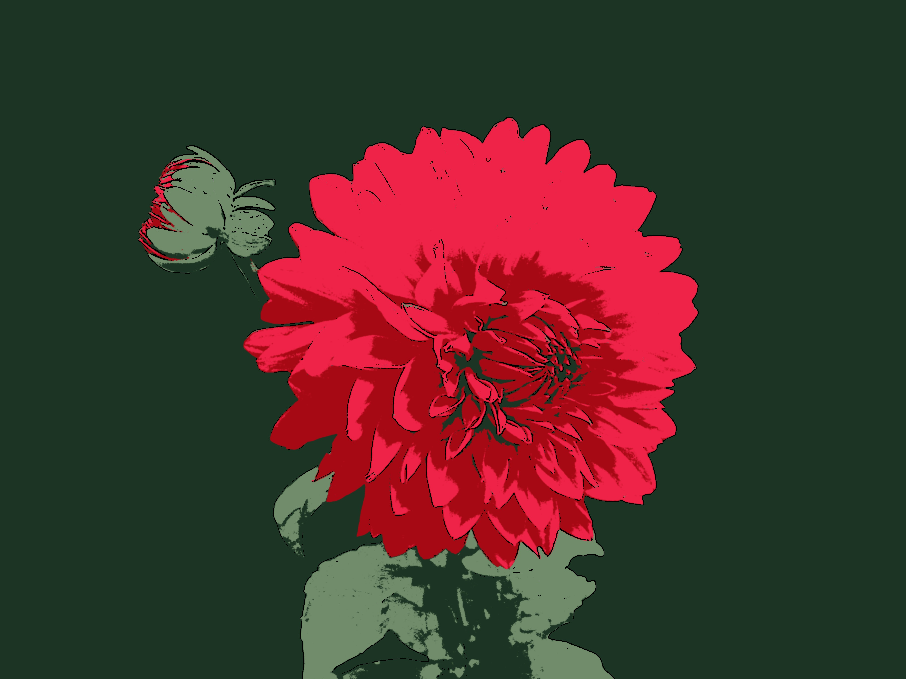

Certainly! Here's a more professional version of the README file:

---

# Image Cartoonifier

This repository contains a Python script that converts images into a cartoon-like effect using OpenCV. The process involves edge detection, color quantization, and bilateral filtering to produce the final cartoon effect.

## Table of Contents

- [Installation](#installation)
- [Usage](#usage)
- [Project Structure](#project-structure)
- [Methodology](#methodology)
- [Examples](#examples)
- [License](#license)
- [Acknowledgements](#acknowledgements)

## Installation

### Prerequisites

Ensure you have Python 3.x installed. You can download it from [python.org](https://www.python.org/).

### Dependencies

Install the required packages using pip:

```sh
pip install opencv-python-headless numpy
```

## Usage

1. **Clone the repository:**

   ```sh
   git clone <repository-url>
   cd <repository-directory>
   ```

2. **Place the image you want to cartoonify in the project directory.**

3. **Modify the script to use your image file name:**

   ```python
   img = read_img('./your_image.jpg')
   ```

4. **Run the script:**

   ```sh
   python cartoonify.py
   ```

5. **The cartoonified image will be saved as `cartoon.jpg` in the project directory.**

## Project Structure

- `cartoonify.py`: Main script for cartoonifying an image.
- `README.md`: Project documentation.
- `requirements.txt`: List of dependencies.

## Methodology

### 1. Read Image

The image is read using OpenCV's `imread` function.

```python
def read_img(filename):
    img = cv2.imread(filename)
    return img
```

### 2. Edge Detection

Edges are detected using grayscale conversion, median blur, and adaptive thresholding.

```python
def edge_detection(img, line_wdt, blur):
    gray = cv2.cvtColor(img, cv2.COLOR_BGR2GRAY)
    grayBlur = cv2.medianBlur(gray, blur)
    edges = cv2.adaptiveThreshold(
        grayBlur, 255, cv2.ADAPTIVE_THRESH_MEAN_C, cv2.THRESH_BINARY, line_wdt, blur
    )
    return edges
```

### 3. Color Quantization

The image colors are quantized using K-means clustering.

```python
def color_quantisation(img, k):
    data = np.float32(img).reshape((-1, 3))
    criteria = (cv2.TermCriteria_EPS + cv2.TermCriteria_MAX_ITER, 20, 0.001)
    _, label, center = cv2.kmeans(
        data, k, None, criteria, 10, cv2.KMEANS_RANDOM_CENTERS
    )
    center = np.uint8(center)
    result = center[label.flatten()]
    result = result.reshape(img.shape)
    return result
```

### 4. Combine Edges and Quantized Colors

The quantized colors are combined with the detected edges to produce the cartoon effect.

```python
edgeImg = edge_detection(img, line_wdt, blur_value)
img = color_quantisation(img, totalcolors)
blurred = cv2.bilateralFilter(img, d=7, sigmaColor=200, sigmaSpace=200)
cartoon = cv2.bitwise_and(blurred, blurred, mask=edgeImg)
cv2.imwrite('cartoon.jpg', cartoon)
```

## Examples

**Original Image:**


**Cartoonified Image:**



## License

This project is licensed under the MIT License. See the [LICENSE](LICENSE) file for more details.

## Acknowledgements

This project uses the OpenCV library for image processing. Special thanks to the OpenCV community for their extensive documentation and support.

---

Feel free to adjust any section according to your specific needs or preferences!
